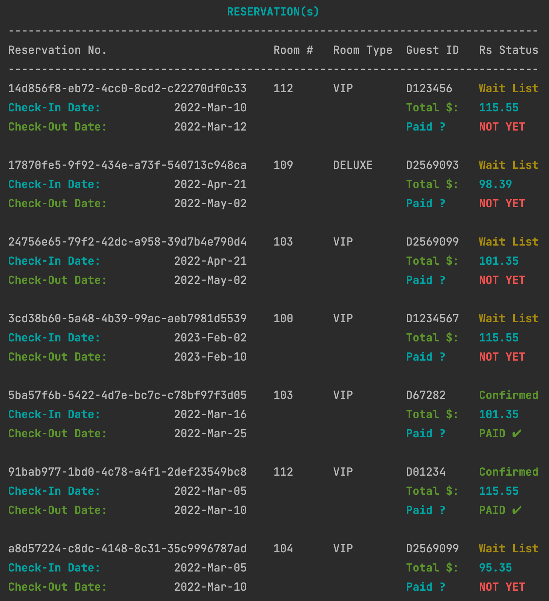

# Hotel Reservation & Payment System Using {C++17} 🏨

## CLI application with data persistence guranteed

#### *- - - Designed for hotel management - - -*

### Object-Oriented Programming and Design Principles

##### *Don't forget to ⭐️️ the project if you like it*. *Thanks*.

###### *Few more functions to be included n implemented which i'll fix soon...*

## *Few ScreenShots 👇*

## *AVAILABLE ROOMS TYPE SCREENSHOT*

## *DATE VALIDATION SCREENSHOT*

## *NEW RESERVATION SCREENSHOT*

## *PAYMENT AND RESERVATION CONFIRMATION*

## *ALL RESERVATIONS WITH STATUS*

